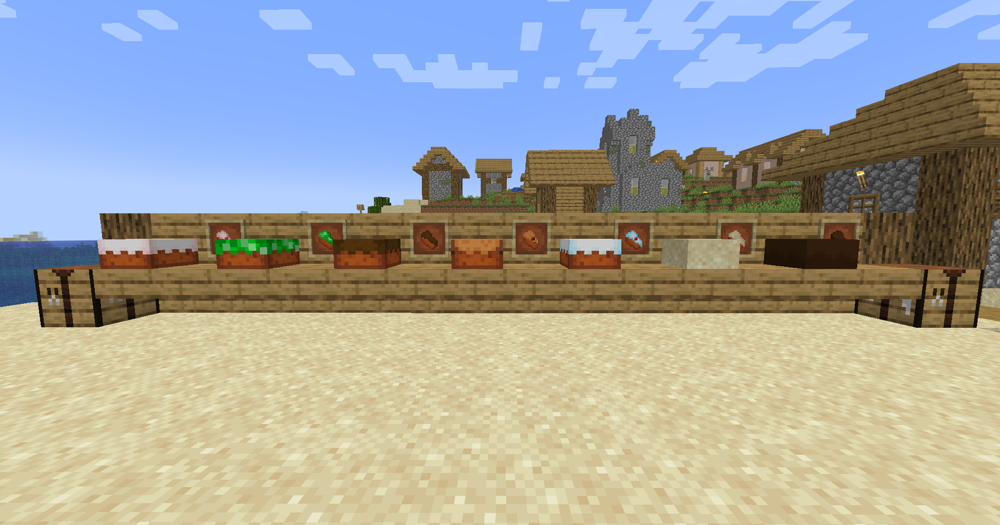
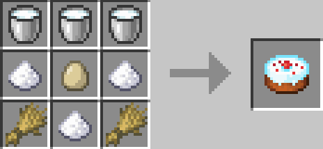
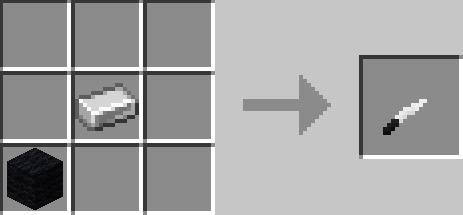

# Yummy Cake

<a href="https://www.curseforge.com/minecraft/mc-mods/fabric-api"></img></a>
<a href="https://files.minecraftforge.net/"></img></a>

**(Depending on the Mod Loader)**

This Mod adds 5 new cakes!

Each cake has a sliced variant which you can get with the new ***cake knife***

</img>

## Recipes

### Choco Cake

Gives you speed.

### Creeper Cake

Has a 50% chance to give you the explosive effect.

### Apple Cake

Gives you some health.

### Cloud Cake

Gives you slow falling.

### Cookie Cake

Gives you saturation.

### Sand Cake

### Brownie Cake

### Cake Knife

When right-clicked on a cake block, it will drop a slice.

